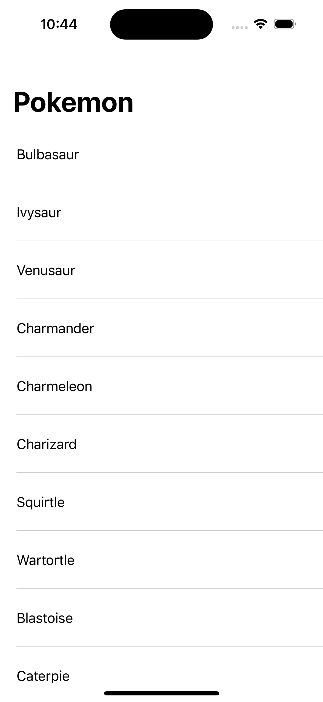

# iOS Interview Project
This is the base project for the iOS interview at BeyondOne. It would be required to clone and run this project before your interview.

# Configure UIKit vs SwiftUI

## UIKit

The project is setup for UIKit by default.

* Contentview is a SwiftUI view hosting the UIViewController (PokemonListViewController) for developing the solution with UIKit.
* PokemonListViewController is the UIViewController
* PokemonViewModelUIKit is the ViewModel used with the above and is used for the UIKit version.

## SwiftUI

To configure the project for SwiftUI edit the ContentView file to enable SwiftUI portion and comment out or delete the UIKit version

* ContentView is the main view
* PokemonViewModel is the view model used with the SwiftUI version

## Requirements
You need to have Xcode. (Tested on Xcode 16.2, but should work with earlier versions as well)
Clone the repository.
Open the project in Xcode.
Build the project and run the project.
If everything goes well, you should see something like this:

We would be expanding the functionality of this starter app during the interview.
